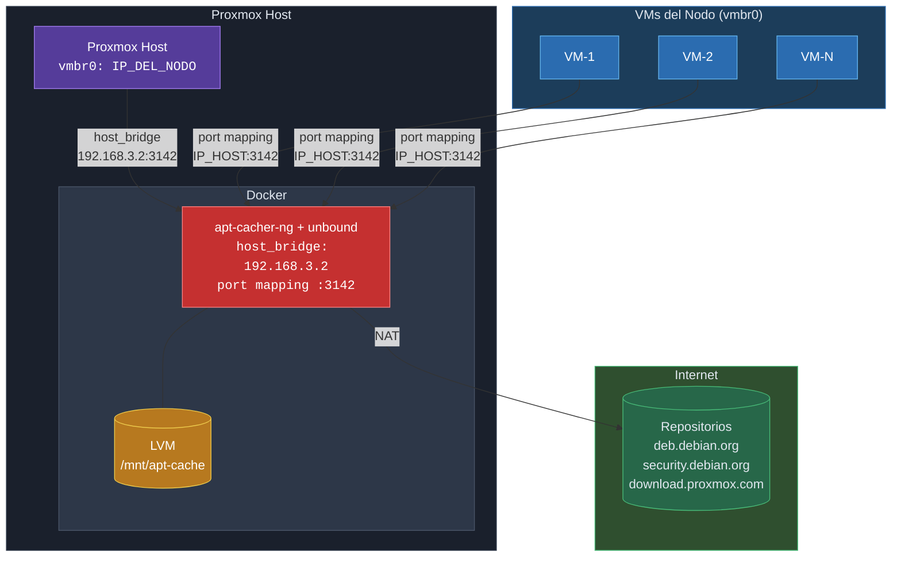
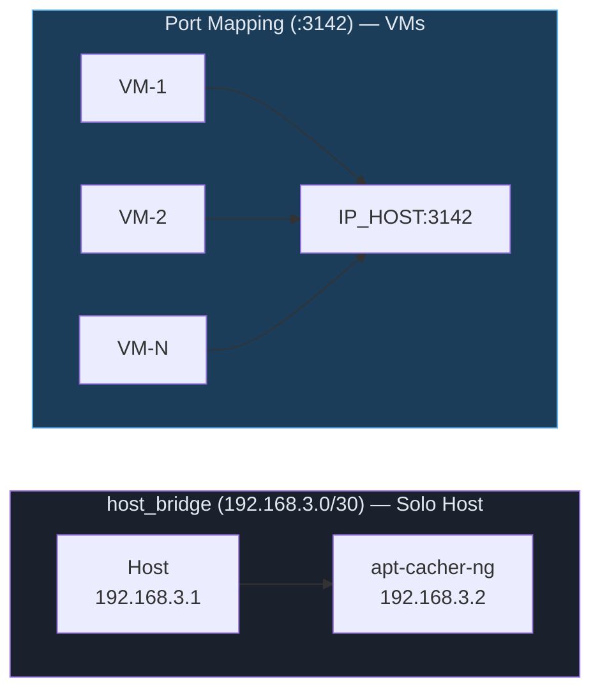
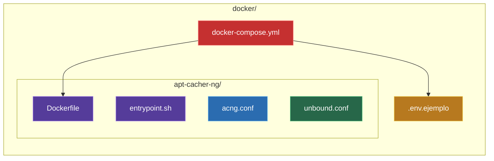
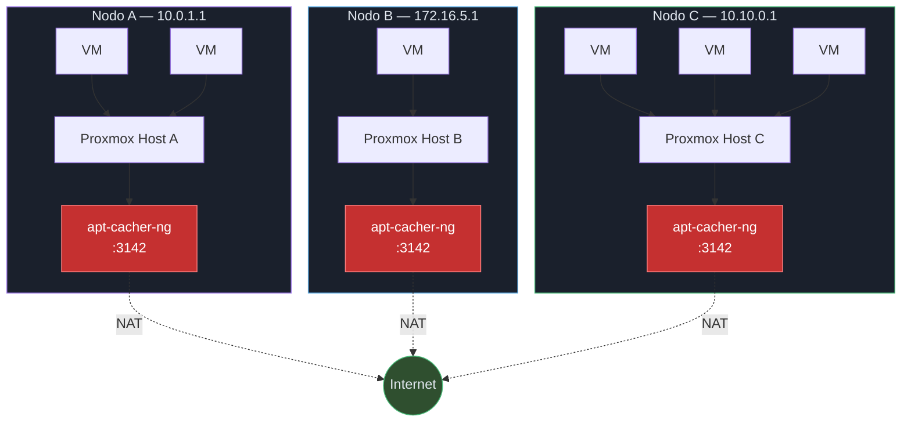

# Caché de Paquetes APT con Docker en Proxmox

## Problema

Cada nodo Proxmox es independiente (sin cluster) y está detrás de NAT. Cuando las VMs
y el propio Proxmox actualizan paquetes, cada uno descarga lo mismo de internet.
Si hay 10 VMs con Debian y sale una actualización de `openssl`, se descarga 10 veces.

## Solución

Un contenedor Docker con `apt-cacher-ng` corriendo **directamente en cada Proxmox host**,
con caché persistente en un volumen LVM. La imagen se construye desde `debian:stable-slim`
con un `Dockerfile` — no se usan imágenes de terceros.

## Arquitectura de Red por Nodo

### Flujo de red

**host_bridge (192.168.3.0/30):** Red bridge user-defined creada por docker-compose.
El host accede al contenedor via `192.168.3.2:3142`. `docker0` está deshabilitado
(`bridge: none` en `daemon.json`) — esta es la única red bridge del host.

**Port mapping (:3142):** Docker publica el puerto 3142 del contenedor en todas
las interfaces del host. Las VMs acceden al caché usando la IP del Proxmox host
(la misma IP de vmbr0). No requiere redes adicionales ni IPs extras.

**DNS:** FreeIPA es el DNS de todas las VMs y del Proxmox host.
Dentro del contenedor, `unbound` corre como DNS cache interno en `127.0.0.1`
para que `apt-cacher-ng` resuelva nombres de repositorios.

## Requisitos

- Proxmox VE 7.x o 8.x
- Espacio en el VG `pve` para un volumen LVM (mínimo 20 GB)
- Docker CE instalado en el Proxmox host
- FreeIPA configurado como DNS en las VMs

## Guía Paso a Paso

| Paso | Documento | Descripción |
|------|-----------|-------------|
| 1 | [01-lvm-cache.md](01-lvm-cache.md) | Crear volumen LVM para el caché |
| 2 | [02-docker-proxmox.md](02-docker-proxmox.md) | Instalar Docker en Proxmox |
| 3 | [03-despliegue.md](03-despliegue.md) | Desplegar el contenedor con docker-compose |
| 4 | [04-clientes.md](04-clientes.md) | Configurar VMs y Proxmox host como clientes |

## Archivos Docker

## Ejemplo de IPs por Nodo

| Nodo | IP del Host (vmbr0) | IP proxy para las VMs | Bridge interno |
|------|--------------------|-----------------------|----------------|
| Nodo A | 10.0.1.1 | 10.0.1.1:3142 | 192.168.3.0/30 |
| Nodo B | 172.16.5.1 | 172.16.5.1:3142 | 192.168.3.0/30 |
| Nodo C | 10.10.0.1 | 10.10.0.1:3142 | 192.168.3.0/30 |

> Las VMs usan la IP del Proxmox host como proxy. No se necesitan IPs adicionales.
> La red bridge interna `192.168.3.0/30` es la misma en todos los nodos — es aislada.

---
[🏠 Inicio](index.md) | [Siguiente ➡️](01-lvm-cache.md) | [📚 Manuales](../index.md)
